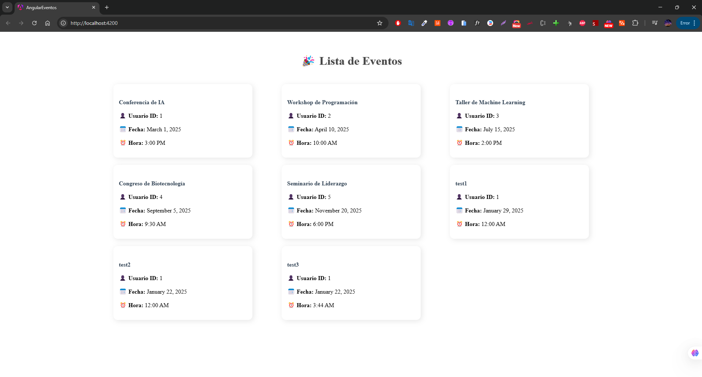

# Angular - Componente de Eventos

Este proyecto contiene un componente en Angular que muestra una lista de eventos en tarjetas (`card`) organizadas en una rejilla (`grid`).

## Instalación y ejecución

1. Clonar el repositorio:
   ```sh
   git clone https://github.com/kevinmore26/buki-examen-tecnico.git
   cd Angular 
   cd angular-eventos
   ```

2. Instalar dependencias:
   ```sh
   npm install
   ```

3. Ejecutar el proyecto:
   ```sh
   ng serve
   ```
   Luego, abrir en el navegador: `http://localhost:4200/`

## Estructura del Proyecto

- **`eventos.component.ts`** → Lógica del componente.
- **`eventos.component.html`** → Plantilla con tarjetas (`cards`).
- **`eventos.component.css`** → Estilos con `grid`.

## Captura del Diseño

